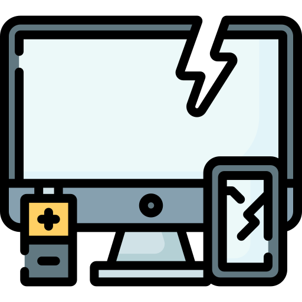

# sitehub

<!DOCTYPE html>
<html lang="pt-br">
<head>
  <meta charset="UTF-8">
  <meta name="viewport" content="width=device-width, initial-scale=1.0">
  <title>HUB - Hardware Unity Bussiness</title>
  <link rel="stylesheet" href="style.css">
</head>
<body>
    <section id="header">
      

        <h1 class="logo">HUB</h1>
        
 
         <h1>HUB. Sempre Apontando Para o Futuro!</h1>
         

         
         
HUB renova com segurança a tecnologia doada localmente e a devolve à nossa comunidade sem custo ou baixo custo para fornecer às populações mais vulneráveis ​​da nossa comunidade as habilidades de alfabetização digital de que precisam para ter sucesso e prosperar.

          
        <button class="common-btn">Ler Mais</button>
        
        

        

      

    </section>
       <nav id="sidenav">
        <ul>
          
            <li><a href="#">Inicio</a></li>
            <li><a href="#">Login</a></li>
          
        </ul>
       </nav>
       
       <!--sobre-->
        <section id="about">
         

         
         

         

          

            <h1>Sobre Nós</h1>
            
            
            
Somos uma organização com a missão de reutilizar tecnologia de forma sustentável, permitir acesso digital e fornecer educação para criar uma comunidade que capacita as pessoas a realizarem seu potencial.
  
             
         
            <h2>A reciclagem transforma coisas em outras, o que é quase mágico.</h2>
            <h3>----João de Paula</h3>
          

         

        </section>

         <!--xxxx-->
         <section id="features">
          

            

              
              <h4>Coletar</h4>
              
Coletamos o E-Lixo

            

            

              
              <h4>Reformar</h4>
              
Reformamos para transformar em material de qualidade

            

            

              
              <h4>Disponibilizar</h4>
              
Disponibilizamos a quem precisa

            

          

         </section>
       
             <section id="c">
              

                

                  

                    <h1>Distribuição Regional de Números de Pessoas que não possuem acesso a tecnologia</h1>
                    
Em milhões de pessoas. Números de 2022, segundo o IBGE

                  

                

                

                  
                

              

             </section>

             <section id="of">
              

              
              

              

               

     
                 <h1>História</h1>
                 
                 
                 
Hub nasceu em meio um projeto escolar, onde quatro alunos se juntaram e discutiram em como o futuro da tecnologia poderia afetar negativamnete o meio ambiente...
 
                
                 <h2>Cuide do meio ambiente, faça o descarte correto de lixo eletrônico.</h2>
                 <h3>----Ecotronics</h3>
                 <button class="common-btn">Começar Agora</button>
               

              

             </section>

              <section id="contact">
                

                    

                    <h1> Se você precisa de um aparelho ligado a tecnologia, inscreva-se!</h1>
                    <form>
                      <input type="text" placeholder="Nome">
                      <input type="email" placeholder="E-Mail">
                      <input type="password" placeholder="Senha">
                      

                        <button class="common-btn">Criar Conta</button>
                        <button class="common-btn">Entrar</button>
                      

                    </form>
                    

                    

                      
                    

                

              </section>

              <section id="footer">
                

                  

                  

                 

                  

    <h4>xxxx</h4>
    <small>xxx xxxx</small>
    <small>xxxx xxxxx</small>  
    

              

    <h4>xxxx</h4>
    <small>xxx xxxx</small>
    <small>xxxx xxxxx</small>  
      

           

    <h4>xxxx</h4>
    <small>xxx xxxx</small>
    <small>xxxx xxxxx</small>  
        

       

                  

                  

         

           

            <small>Support@HUB.com</small> 
            <small>Copyright 2023 HUB</small>

             

          

     <h1>HUB</h1>
        

         

                  

                

              </section>
            
              

                
                
                
                
              

          

       
</body>
</html>
